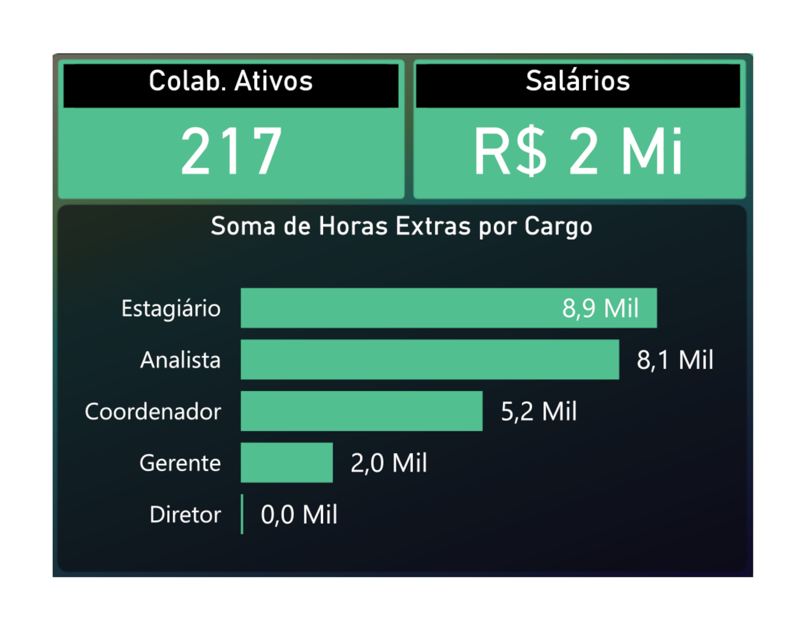

# Criando um Dashboard de RH em Power BI

## Introdução

Estou criando um dashboard sobre RH a partir de um conjunto de dados fictício. Este dashboard oferece insights sobre o número de contratações da empresa, colaboradores ativos, turnover, média salarial por cargo, dentre outros.

## Passo a Passo para Criar o Dashboard

### Criando um plano de fundo
  - Plano de fundo e tooltip criados utilizando Microsoft PowerPoint

### Importação e Transformação dos Dados

- **Passos de Transformação:**
  - **Remoção de dados nulos:** As colunas e linhas nulas foram removidas da base de dados.
  - **Alteração dos tipos de dados:** Após verificação, observou-se que os tipos de dados não correspondiam ao desejado e, assim, foi feita a alteração.

- **Criando novas medidas com DAX:**
  - **Contratações:** Medida criada a partir do número de linhas da base de dados utilizando a função `COUNTROWS()`. 
    > *Contratações = COUNTROWS(BaseFuncionarios)*
  - **Desligamentos:** Medida criada a partir da coluna `Data de Demissao` utilizando a função `COUNT()`.
    > *Desligamentos = COUNT(BaseFuncionarios[Data de Demissao])*
  - **Colab. Ativos:** Medida criada a partir do cálculo entre as medidas: `Contratações` e `Desligamentos`.
    > *Colab. Ativos = [Contratações] - [Desligamentos]*
  - **Turnover:** Medida criada a partir do cálculo entre as medidas: `Desligamentos` e `Contratações`.
    > *Turnover = [Desligamentos] / [Contratações]*
  - **Média Salarial:** Medida criada a partir da coluna `Salario`, utilizando as funções `COUNT()` e `SUM()`.
    > *Média Salarial = SUM(BaseFuncionarios[Salario]) / COUNT(BaseFuncionarios[Salario])*

## Interpretação dos Insights

## Dashboard

### Painel Tooltip

### Contratações
- **Insight**: Com um total de 234 contratações, o gráfico mostra a variação no número de contratações ao longo do tempo.

### Colab. Ativos
- **Insight**: Com um total de 217 colaboradores ativos, nota-se que a empresa mantém uma força de trabalho estável.

### Desligamentos e Turnover
- **Insight**: Com apenas 17 desligamentos e um turnover de 7,26%, confirmamos a estabilidade da força de trabalho da empresa.

### Colaboradores Ativos por Cidade
- **Insight**: Podemos ver como está distribuída a base de funcionários dessa empresa, com destaque para uma maior quantidade de colaboradores na cidade de São Paulo. Além disso, com o painel *Tooltip* podemos observar mais informações como o salário total e cargos de cada cidade.

### Colaboradores Ativos por Gênero
- **Insight**: A empresa contém uma base de colaboradores com uma excelente diversidade, sendo 52,07% do sexo masculino e 47,93% do sexo feminino. 

### Gráfico de Árvore Hierárquica
- **Insight**: Neste gráfico, podemos ver como está distribuída a base de funcionários com base em suas áreas e cargos, onde a maior parte se encontra na área *Administrativa* com 58 colaboradores e desses, 23 são de cargo *estagiário*.

### Média Salarial por Cargo
- **Insight**: Podemos notar que o cargo com maior média salarial é o de *Diretor*. Utilizando filtros, podemos identificar que 100% dos diretores são do sexo feminino.

## Considerações sobre a Base de Dados

A base de dados utilizada contém as seguintes colunas:

- **ID RH:** Identificação do colaborador.
- **Nome:** Nome do colaborador.
- **Gênero:** Gênero dos funcionários.
- **Cidade:** Cidade onde se encontra cada colaborador.
- **Data de Contratação:** Data de contratação do funcionário.
- **Data de Demissão:** Data de demissão, caso haja.
- **Salário:** Salário de cada colaborador.
- **Cargo:** Cargo do funcionário.
- **Área:** Área em que o colaborador está atuando.
- **Horas Extras:** Número de horas extras dos funcionários.
- **Avaliação do Funcionário:** Nota avaliada de cada colaborador.
